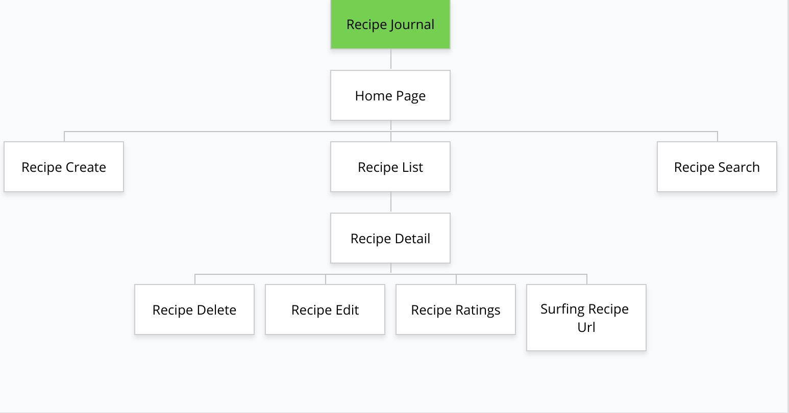
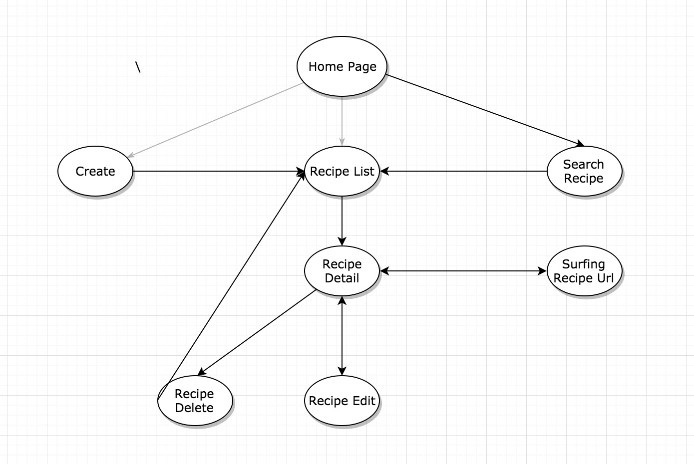

Recipe Journal
==============
Feature
-------
* List all of the recipes
* Search recipes by key words
* Create a new recipe
* Read the detail information of a certain recipe
* Provide a URL of the recipe to access extra infomation online
* Edit a recipe
* Delete a recipe
* Make a ratting for a recipe

Description of Acitivies
-----------
In this APP, it includes 4 acitivies which are <br/>
- CreateRecipeActivity.java
- RecipeDetailsActivity.java
- EditRecipeActivity.java		
- MainActivity.java

Among them `MainActivity` is used to present the homepage which includes the features of presenting recipe list and the searching result of recipe list.

Sitemap
-------


Click Stream
------------


Database Model
-------------
```java
public class Recipe {

    private String recipe_name;
    private String image_path;
    private String description;
    private List<String> ingredients;
    private List<String> direction;
    private float average_ratings = 0;
    private int rate_num = 0;
    private String url;
}
```

```javascript

{
  "recipes" : {
    "Asparagus, Pecorino and Red Onion Salad" : {
      "average_ratings" : 3,
      "description" : "A raw asparagus salad that refreshes your palate.",
      "direction" : [ "1. Cut the asparagus, including the tips into very thin slices, crosswise and place in a medium bowl. Add the red onion and pecorino and toss to combine. Dress with the vinegar, olive oil and salt and toss again. This salad should be fairly heavily dressed. The vinegar will sort of \"cook\" or tenderize the asparagus.", "2. It is best to do this about an hour or so in advance to let the flavors \"marry\". Semplice!" ],
      "image_path" : "4e991509-1e21-4572-b37f-ddea946631e8_asparagus-pecorino-red-onion-salad_webready.jpg",
      "ingredients" : [ "1 bunch pencil asparagus, tough bottom stems removed", "1 small red onion, finely diced", "1 cup coarsely grated aged pecorino", "12 cup red wine vinegar", "Extra-virgin olive oil", "Kosher salt" ],
      "rate_num" : 0,
      "recipe_name" : "Asparagus, Pecorino and Red Onion Salad",
      "url" : "http://www.foodnetwork.ca/everyday-cooking/recipe/asparagus-pecorino-and-red-onion-salad/21453/"
    }
    ....

  }
}
```

* `recipes` - a list of `recipe` objects, keyed by recipe name. So
    `/recipes/<recipe name>/url` is the url address of the recipe with id=`<recipe name>`.

  * `ingredients` - a list of `ingredient` objects, Each item contains one item of ingredients
  * `direction` - similar to ingredients
  * `image_path` - the name of picture which storing in the `Firebase Storage` with the same name.
  * `recipe_name` - recipe name
  * `description` - a breif description of recipe.
  * `recipe_name` - recipe name
  * `url` - as an extra information of recipe, to make sure the user link a webpage on Internet to know more about this recipe.

Worth being Mentioned
--------
**1. A special class storing only static attributes for sharing data among all of the activities.**

```
public class DataShareInvertory {

    private static int visible_position = 0;

    public static int getVisible_position() {
        return visible_position;
    }

    public static void setVisible_position(int visible_position) {
        DataShareInvertory.visible_position = visible_position;
    }
}
```
The attribute of "visible_position" is used to store the first visible position in the ListView. To keep the position makes sure once the user go back the recipe list activity from the recipe detail activity, the listView will present the previous postion when he left.<br/>

**2. Cache the images downloading from Firebase Storage using a class designed in Singleton Pattern.**

```java
private static RecipeImageUtils instance;
private static LruCache<String, BitmapDrawable> mImageCache;

private RecipeImageUtils() {}

public static RecipeImageUtils getInstance()
{
    if(instance==null)
    {
        instance = new RecipeImageUtils();

        int maxCache = (int) Runtime.getRuntime().maxMemory();
        int cacheSize = maxCache / 8;
        mImageCache = new LruCache<String, BitmapDrawable>(cacheSize) {
            @Override
            protected int sizeOf(String key, BitmapDrawable value) {
                return value.getBitmap().getByteCount();
            }
        };
    }

    return instance;
}
```
**2. Dynamic adding and removing "textView" or "editView" into the LinearLayout.**
```xml
<LinearLayout
    android:layout_width="match_parent"
    android:layout_height="wrap_content"
    android:id="@+id/ingredients_input_layout"
    android:orientation="vertical">
</LinearLayout>
```
```java
private void handleDynamic_EditView_Button()
{
    layoutIngredient = findViewById(R.id.ingredients_input_layout);
    add_ingredient_button = findViewById(R.id.button_add_ingredient);
    add_ingredient_button.setOnClickListener(new View.OnClickListener() {
        @Override
        public void onClick(View v) {
            if(ingredients_nums < MAX_NUM)
            {
                layoutIngredient.addView(addEditViewIntoLayout("Please Input Ingredients!"));
                ingredients_nums++;
            }

        }
    });
    minus_ingredient_button = findViewById(R.id.button_minus_ingredient);
    minus_ingredient_button.setOnClickListener(new View.OnClickListener() {
        @Override
        public void onClick(View v) {

            if(ingredients_nums > 0)
            {
                layoutIngredient.removeViewAt(ingredients_nums-1);
                ingredients_nums--;
            }

        }
    });
    ......
}
```
Different recipes need different numbers of direction and ingredients. To make sure direciton and ingredients presented clearly, each item of them is using one component E.g. TextView and EditView. Regarding the different numbers of the item, that is why it needs a solution of dynamic adding components.

Reference
---------
[1] Foodnetwork.ca *Home Page.* [On-line]. Availiable: <u>http://www.foodnetwork.ca/everyday-cooking/recipes/</u> [2018] <br/>
[2] 机械厨房秤图标. [On-line]. Availiable: <u>http://www.shejiye.com/index.php?m=content&c=index&a=show&catid=22&id=135641</u> [2018] <br/>
[3] Android中图片的三级cache策略. [On-line]. Availiable: https://blog.csdn.net/singwhatiwanna/article/details/9054001[2018]<br/>
[4] Eric Desjardin. (2018). *CSCI 5708 Assignment*. [On-line]. Availiable: <u>https://dal.brightspace.com/d2l/le/content/68186/viewContent/931110/View</u> [2018]
